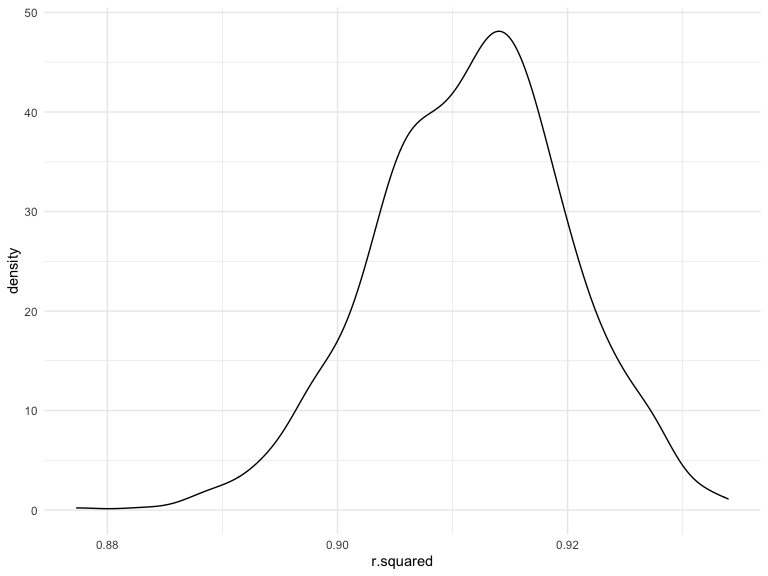
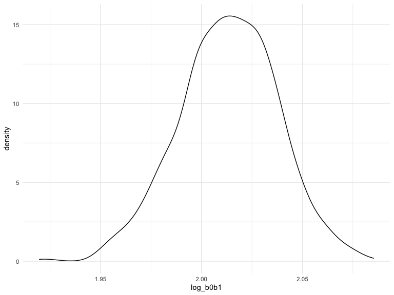
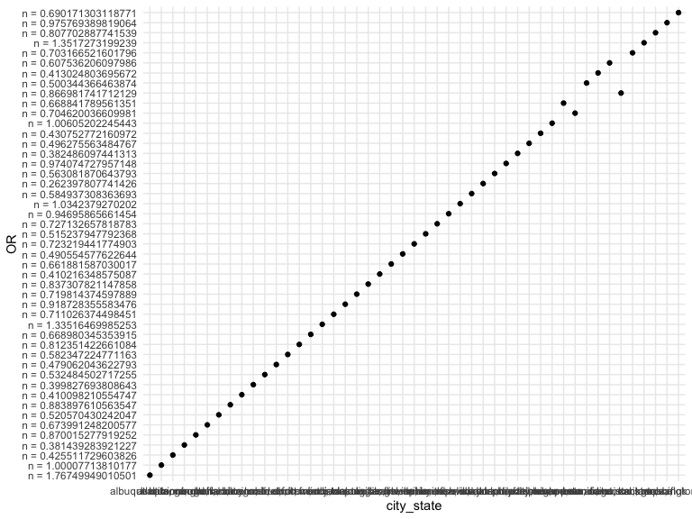
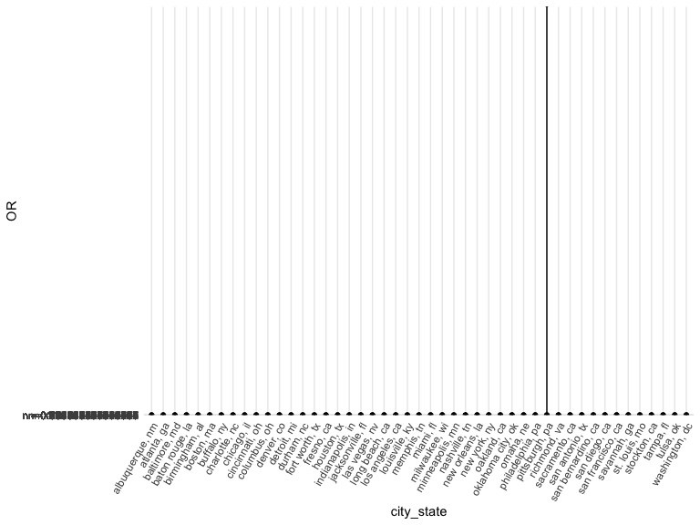

p8105_hw6_bes2161.Rmd
================
Brittany Shea
2022-12-03

### Problem 1

# Load and clean data:

``` r
weather_df = 
  rnoaa::meteo_pull_monitors(
    c("USW00094728"),
    var = c("PRCP", "TMIN", "TMAX"), 
    date_min = "2017-01-01",
    date_max = "2017-12-31") %>%
  mutate(
    name = recode(id, USW00094728 = "CentralPark_NY"),
    tmin = tmin / 10,
    tmax = tmax / 10) %>%
  select(name, id, everything())
```

    ## Registered S3 method overwritten by 'hoardr':
    ##   method           from
    ##   print.cache_info httr

    ## using cached file: ~/Library/Caches/R/noaa_ghcnd/USW00094728.dly

    ## date created (size, mb): 2022-09-29 10:33:58 (8.401)

    ## file min/max dates: 1869-01-01 / 2022-09-30

# Produce estimates of two quantities using bootstrap sample:

``` r
weather_df %>% 
  modelr::bootstrap(n = 1000) %>% 
  mutate(
    models = map(strap, ~lm(tmax ~ tmin, data = .x) ),
    results = map(models, broom::glance)) %>% 
  select(-strap, -models) %>% 
  unnest(results) %>% 
  ggplot(aes(x = r.squared)) + geom_density()
```



The $\hat{r}^2$ value is high, the lower bound at 1 could be an issue,
and the shape is not symmetric.

# Plot distribution:

``` r
weather_df %>% 
  modelr::bootstrap(n = 1000) %>% 
  mutate(
    models = map(strap, ~lm(tmax ~ tmin, data = .x) ),
    results = map(models, broom::tidy)) %>% 
  select(-strap, -models) %>% 
  unnest(results) %>% 
  select(id = `.id`, term, estimate) %>% 
  pivot_wider(
    names_from = term, 
    values_from = estimate) %>% 
  rename(beta0 = `(Intercept)`, beta1 = tmin) %>% 
  mutate(log_b0b1 = log(beta0 * beta1)) %>% 
  ggplot(aes(x = log_b0b1)) + geom_density()
```



The distribution is a bit skewed. It also includes some outliers.

### Problem 2

# Load and clean data:

``` r
wp = read_csv("data/homicide-data.csv") %>% 
  janitor::clean_names() %>% 
  mutate_if(is.character, str_to_lower) %>% 
  unite("city_state", city:state, sep = ", ") %>% 
  mutate(reported_date = lubridate::ymd(reported_date)) %>% 
  mutate(
    solved = as.numeric(disposition == "closed by arrest"),
    victim_age = as.numeric(victim_age)) %>% 
  filter(victim_race == "white" | victim_race == "black", city_state != "dallas, tx" & city_state != "phoenix, az" & city_state != "kansas city, mo" & city_state != "tulsa, al")
```

    ## Rows: 52179 Columns: 12
    ## ── Column specification ────────────────────────────────────────────────────────
    ## Delimiter: ","
    ## chr (9): uid, victim_last, victim_first, victim_race, victim_age, victim_sex...
    ## dbl (3): reported_date, lat, lon
    ## 
    ## ℹ Use `spec()` to retrieve the full column specification for this data.
    ## ℹ Specify the column types or set `show_col_types = FALSE` to quiet this message.

# Create Baltimore dataframe:

``` r
baltimore_df = wp %>% 
  filter(city_state == "baltimore, md") %>%
  select(solved, victim_age, victim_race, victim_sex)
```

# Fit logistic regression model for Baltimore using `glm`:

``` r
balt_fit_logistic = 
  baltimore_df %>% 
  glm(solved ~ victim_age + victim_race + victim_sex, data = ., family = binomial()) 
```

# Tidy data and obtain the estimate and confidence interval of the adjusted odds ratio:

``` r
balt_fit_logistic %>%  
  broom::tidy() %>% 
  mutate(OR = exp(estimate),
    ci_lower = quantile(OR, 0.025), 
    ci_upper = quantile(OR, 0.975)) %>% 
  select(term, OR, ci_lower, ci_upper) %>% 
  filter(term == "victim_sexmale") %>% 
  knitr::kable(digits = 3)
```

| term           |    OR | ci_lower | ci_upper |
|:---------------|------:|---------:|---------:|
| victim_sexmale | 0.426 |    0.468 |    2.249 |

# Define function:

``` r
fun <- function(df) {
    glm(
        formula = solved ~ victim_age + victim_race + victim_sex
        , data = df
        , family = binomial
    ) %>%
    
    broom::tidy() %>%
    mutate(OR = exp(estimate),
    ci_lower = quantile(OR, 0.025), 
    ci_upper = quantile(OR, 0.975)) %>% 
    select(term, OR, ci_lower, ci_upper)
}
```

# Run `glm` for each of the cities:

``` r
all_fit = wp %>% 
  nest(data = -city_state) %>% 
  mutate(results = map(data, fun)) %>% 
  unnest(results) %>% 
  filter(term == "victim_sexmale")
```

# Create a plot:

``` r
all_fit %>% 
  mutate(
    OR = str_c("n = ", OR),
    OR = fct_inorder(OR)) %>% 
  ggplot(aes(x = city_state, y = OR)) +
  geom_point()
```



``` r
all_fit %>% 
  mutate(
    OR = str_c("n = ", OR),
    OR = fct_inorder(OR)) %>% 
  ggplot(aes(x = city_state, y = OR)) +
  geom_point() +
  geom_errorbar(aes(ymin = ci_lower, ymax = ci_upper), width = 0.2) +
  theme(axis.text.x = element_text(angle = 60, hjust = 1))
```



This plot shows that New York, NY has the smallest OR, while
Albuquerque, NM has the highest OR for solving homicides for male
victims compared to female victims.
